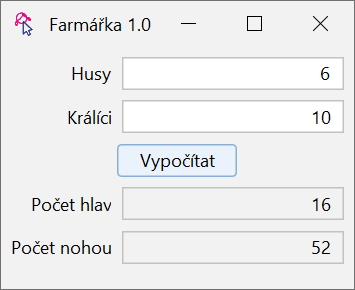

# Úkol 6 – Husy a králíci

Naprogramujte aplikaci, která se hodí každému farmáři a farmářce.

Máte malou farmu s husami a králíky. Když zadáte do appky počet králíků a počet hus, appka vám vypočítá, kolik nohou
a hlav na farmě je. Mutanti a zvířata bez nožiček a hlaviček se nepočítají.

Pozor, `JTextField`y s výslednými hodnotami by neměly být editovatelné (tj. měly by být read-only), ale pořád by mělo
jít v nich označit hodnotu a zkopírovat jit do schránky (Ctrl+C / Cmd+C).

V aplikaci už je připraven dvousloupcový layout, první sloupec je určen pro popisky (label), druhý sloupec pro vstupní pole (textfield).

Aplikace bude po spuštění vypadat např. takhle:



## Rady na cestu
`JTextField` má vlastnosti `editable` a `enabled`. (Připomínám, že vlastnost/property znamená, že existuje odpovídající
setter a getter.) Vyzkoušejte, jaký je mezi nimi rozdíl a která se hodí pro splnění úkolu.

Aritmetiku provádějte v proměnné typu `int`. Převod ze `String` na `int` se provede takto:

```java
String text1 = …;
int cislo1 = Integer.parseInt(text1);
```

Převod z `int` na `String` se provede takto:

```java
int cislo2 = …;
String text2 = Integer.toString(cislo2);
```

Případně můžete rovnou připojit `int` do `String`u:

```java
int cislo3 = …;
String text3 = "Počet králíků: " + cislo3;
```

Neplatné hodnoty zadané do `JTextField`u neřešte.

Tip: bývá zvykem textová pole pro čísla zarovnávat vpravo. Zarovnání textu v textfieldu nastavuje následující kód:

```java
textField.setHorizontalAlignment(JTextField.TRAILING);
```


# Bonus 1

Místo `JTextField` můžete použít `JSpinner`, což je komponenta, která umožňuje pomocí šipek krokovat hodnoty. Používá se
často právě pro zadávání čísel – neumožní zadat jiné znaky, než číslice, a navíc umožní uživateli jedním kliknutím
zvýšit nebo snížit hodnotu (typicky o jedničku, ale lze to změnit). V jednodušší variantě vytvoříte nový `JSpinner`
voláním prázdného konstruktoru `new JSpinner()`. Tím vznikne číselný spinner s výchozí hodnotou 0, který krokuje po jedné
a nemá žádné omezení (kladné ani záporné). Zadanou hodnotu pak získáš voláním metody `getObject()` – výsledek však budete
muset přetypovat na `Integer`:

```java
JSpinner spinner = new JSpinner();
int cislo4 = (Integer) spinner.getObject();
```

# Bonus 2
Ve vylepšené variantě můžete konstruktoru spinneru předat instanci `SpinnerModelNumber`, která umožňuje nastavit výchozí
hodnotu, velikost kroku, ale hlavně minimální a maximální hodnotu. Nastavte je tak, aby nebylo možné zadat záporný počet
kusů. Dokumentaci najdete zde: [SpinnerModelNumber](https://docs.oracle.com/en/java/javase/11/docs/api/java.desktop/javax/swing/SpinnerNumberModel.html).
